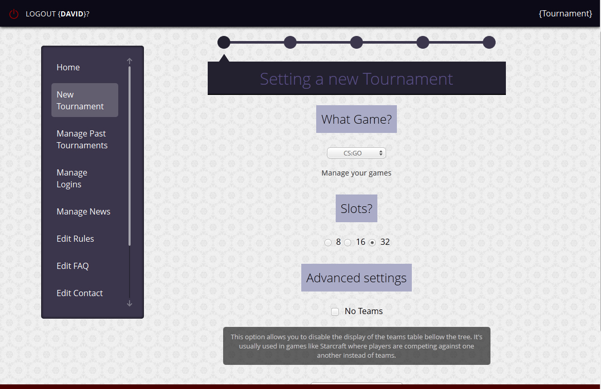
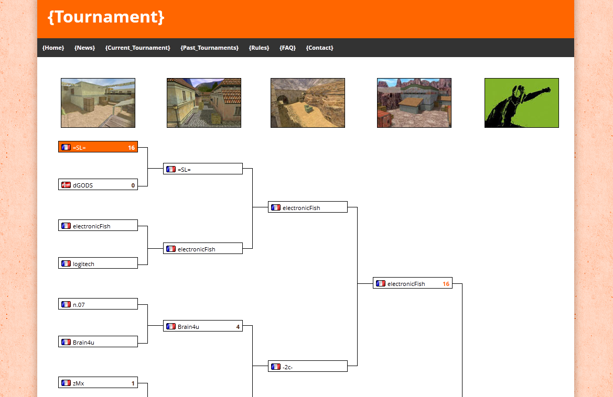
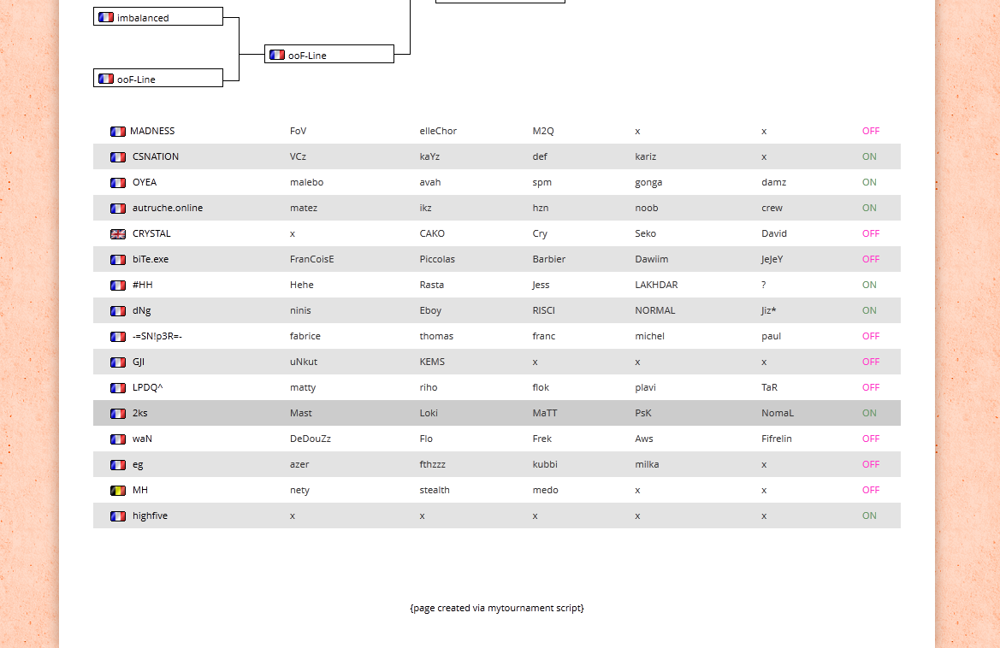

Wiitop
======

## Preface

Wiitop was a tournament script created around 2005 I think. It used to be translated in 8 different languages (see old languages.php) and was used by something like 7000 different organizations on irc and irl.

But anyway, I remade the project to learn CodeIgniter and Sass and Zurb Foundation and... I made a mess. And I stopped being interested in the project and I moved on. And now wiitop.net is down and people are asking me for the script so this is a start... I pushed the entire source code.

The code is old, not pretty, maybe unsecure, and also I can't find the .sass files that were a huge simplification of the brackets...

## Can I use that?

Yes it works (I just helped some dude setting it up on its server). 

## How to use it?

* Copy the content in the src folder
* Import the mysql tables from wiitop.sql
* Configure application/config/database.php with your database password